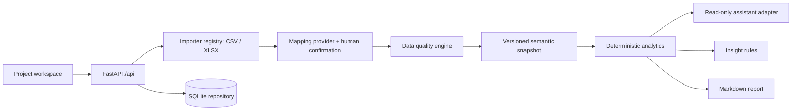

# Architecture

## Decision
Use a modular monorepo: React/TypeScript/Vite client and Python/FastAPI service. SQLite keeps local development simple; repositories own storage so PostgreSQL can replace it. Synchronous bounded ingestion is appropriate for the scaffold. A worker and object store become necessary for large workbooks and schedule files. A single full-stack JavaScript application would reduce runtimes but make future Python scheduling/data tooling less direct; microservices would add operational cost before contracts stabilize.

## Module ownership
| Path | Responsibility |
|---|---|
| apps/web/src | Workspace navigation, import review, insights, assistant and reports |
| apps/api/controlcheck/importers.py | Bounded CSV/XLSX reading and source identity |
| apps/api/controlcheck/semantic.py | Mapping suggestions, canonical fields and row validation |
| apps/api/controlcheck/analytics.py | Pure snapshot measures and evidence-backed insight rules |
| apps/api/controlcheck/assistant.py | Read-only analytical response and provider contract |
| apps/api/controlcheck/repository.py | SQLite transactions and project-scoped persistence |
| apps/api/controlcheck/main.py | HTTP orchestration and publication guard |
| packages/contracts | Exported OpenAPI contract and semantic version policy |
| tests | Domain and HTTP journey checks |
| data/samples | Synthetic, explicitly labelled input fixtures |
| infra | Local run boundaries and future infrastructure decisions |

## Lifecycle and persistence
Inspection reads a bounded file without persisting it and returns sheet names, a header-row suggestion and an eight-row matrix preview. Import then creates an immutable source record containing project ID, file name, SHA-256, selected sheet, physical header row, normalization choices, headers and parsed rows. Raw bytes are not retained in this increment. Uploads are drafts until mapping confirmation and validation succeed. Preview returns errors and warnings without changing the published model. Publication is one transaction: store mapping, normalized rows, reporting date and incremented version, then set the project's active snapshot ID. Prior snapshots stay available in storage; history UI is a later increment. Reconfirming an identical mapping/source returns the existing snapshot rather than duplicating it.

Every SQL lookup includes project scope. This prevents accidental mixing within the application, but is NOT user authorization: the local service has no login. Bind to 127.0.0.1. No deployment to a shared/public host before authentication, workspace membership and authorization tests exist. CORS is limited to the local Vite origin. A source ID from project B is not accessible through project A.

## Calculations
All rows must contain the inputs for an aggregate; otherwise return null and a limitation. This avoids presenting a partial sum as a project total.

- Progress = sum(actual_progress × weight) / sum(weight). If no explicit weights exist, use budget weights when every budget is present and total budget > 0; otherwise equal weights. Mixed explicit weights suppress progress until resolved. The selected basis is returned.
- BAC = sum(budget); PV = sum(budget × planned_progress / 100); EV = sum(budget × actual_progress / 100); AC = sum(actual_cost).
- SPI = EV / PV when PV > 0; CPI = EV / AC when AC > 0. SV = EV − PV; CV = EV − AC. Monetary variance is NOT duration variance.
- Overdue: planned_finish < snapshot reporting date and actual_progress < 100. Missing facts suppress classification for that row; coverage is returned. No critical-path inference.
- No trend, forecast or root cause without the additional evidence needed for it. A single snapshot does not prove why SPI changed.

## AI boundaries
MappingProvider and AssistantProvider are protocols. Local implementations are the only enabled providers in this scaffold. Future LLM adapters receive a bounded typed tool context, not database credentials. Schema suggestions must pass allow-list and uniqueness checks and human confirmation. Answers must cite source IDs/rows and show snapshot version. Provider failures must not publish data or invent facts. Do not use a vector store as the calculator or as the canonical numeric model.

## Extension contracts
MPP/XER importers should produce staged tables and diagnostics via Importer, preserving calendars, relationships, constraints, WBS and baselines before normalization. A ForecastProvider accepts immutable snapshot IDs, method/version and assumptions and returns ranges with backtest metadata. AgentAction proposals carry evidence, expected effect, scope and explicit approval state; a separate executor must enforce permissions and idempotency. These contracts are interfaces only; no forecast or action executor is enabled.

## Production evolution
Move raw source bytes into a private object store, metadata/models to PostgreSQL, ingestion into queued jobs and authentication to an OIDC provider. Apply tenant-scoped authorization to every request and storage query. Add upload streaming/reverse-proxy body limits, compressed-size defenses, antivirus, rate limits, source deletion/retention, structured audit events, migrations, telemetry and secret management before shared use. SQLite schema initialization is for fresh local installs; production migrations are not implemented.

## References
- [Vite guide](https://vite.dev/guide/)
- [FastAPI file uploads](https://fastapi.tiangolo.com/tutorial/request-files/)

